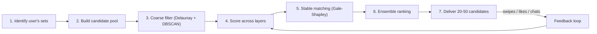
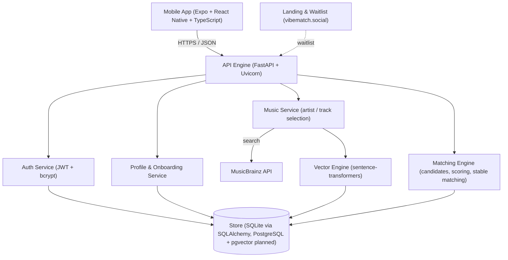

<h1 align="center" id="title">VIBEMATCH</h1>

<p align="center"></p>

# VibeMatch
 
> **A Music-First, Multi-Vector Matchmaking Engine — A Proof of Concept for Dating Apps Built on Compatibility, Not Exposure**
 
VibeMatch is a matchmaking system that models people as layered vectors (taste, identity, behavior, preference) instead of a photo and a filter form, then uses stable-matching mathematics to pair people who genuinely want each other.
 
By combining music-derived semantic embeddings, multi-set behavioral clustering, mutual-attraction scoring, and Gale-Shapley stable matching, VibeMatch explores what a dating app looks like when the matching engine, not the swipe feed, is the product.
 
**Landing page & waitlist:** [vibematch.social](https://www.vibematch.social/) — *Match on taste, meet on vibe.*
 
---
 
## Table of Contents
 
1. [Core Concepts & Multi-Layer Architecture](#core-concepts--multi-layer-architecture)
2. [The Problem: Structural Weaknesses in Traditional Dating Apps](#the-problem-structural-weaknesses-in-traditional-dating-apps)
3. [Architectural Comparison](#architectural-comparison)
4. [Implementation Status](#implementation-status)
5. [Mathematical & Algorithmic Specification](#mathematical--algorithmic-specification)
6. [The Matching Pipeline](#the-matching-pipeline)
7. [System Architecture & Tech Stack](#system-architecture--tech-stack)
8. [API Reference](#api-reference)
9. [Data Model](#data-model)
10. [Getting Started (Step-by-Step Setup)](#getting-started-step-by-step-setup)
    - [Backend Setup (FastAPI)](#1-backend-setup-python--fastapi)
    - [Mobile Setup (Expo + React Native)](#2-mobile-setup-expo--react-native)
    - [Seed Data & Test Suite](#3-seed-data--test-suite)
11. [Configuration & Environment Variables](#configuration--environment-variables)
12. [Design Principles](#design-principles)
13. [Development Roadmap](#development-roadmap)
14. [Security & Privacy](#security--privacy)
15. [Repository Structure](#repository-structure)
16. [Contributing](#contributing)
17. [License](#license)
---
 
## Core Concepts & Multi-Layer Architecture
 
Conventional dating apps rank people by exposure: who is active, who is photogenic, who fits a filter. VibeMatch operates on a different premise: **compatibility is a multi-dimensional optimization problem, not a single score.**
 
1. **Music as a Semantic Signal**: Each user selects artists and tracks (sourced from MusicBrainz). The selections are embedded into a dense vector, so every user becomes a point in taste-space and similarity becomes measurable distance, not a genre checkbox.
2. **Four Independent Data Layers**:
   - **Music / Taste**: what you listen to, embedded as a vector.
   - **Identity / Demographics**: age, location, gender, sexuality, and profile attributes; used for coarse filtering and set assignment.
   - **Behavioral / Personality**: signals from bio, prompts, swipes, and conversations; captures implicit attraction patterns.
   - **Preference / Goals**: what the user is explicitly looking for, and dealbreakers.
3. **Multi-Set Membership**: A user is never trapped in one bucket. They belong to demographic, taste, behavioral, and preference sets *simultaneously*, and those sets can change as the user evolves.
4. **Stable, Mutual Matching**: Candidates are ranked by both sides. Gale-Shapley stable matching guarantees that no two users would both prefer each other over their assigned matches.
5. **Incentive-Aware Design**: A game-theoretic layer (costly signaling, selectivity penalties, feed balancing) discourages the swipe-on-everyone equilibrium that degrades most apps.
6. **Explainability**: Because scoring is layered, every match can answer *why*: "you matched on taste" vs. "you matched on intent and location."
```
USER AS A POINT IN FOUR LAYERS:
[ Music vector ] ─┐
[ Identity      ] ─┼──> Multi-set assignment ───> Hierarchical clusters ───> Stable matching
[ Behavior      ] ─┤       (Set-D1, Set-M1,         ("Young Active Indie        (mutual ranking,
[ Preference    ] ─┘        Set-B1, Set-P1)          Lovers", ...)               no unstable pairs)
                                    ▲                                                  │
                                    └────────────── feedback loop (swipes, chats) ─────┘
```
 
---
 
## The Problem: Structural Weaknesses in Traditional Dating Apps
 
Most matching products are built around a profile card and a swipe. That interface hides four structural problems.
 
```text
[ Profile-Only Matching ]
Signal:        photos + a few filter fields
Ranking:       by visibility / activity
Feedback:      unlimited, free swipes
Explanation:   none
```
 
### The Compatibility Gap
1. **Shallow Signals**: Demographic filters and shared-interest tags say little about whether two people would actually connect. Two people who both list "music" as an interest may have nothing in common.
2. **One-Sided Ranking**: Feeds tend to optimize for who is *shown*, not for who is *mutually* interested, which concentrates attention on a small share of users and leaves everyone else unseen.
3. **Free Signaling**: When a like costs nothing, it carries little information. Users are pushed toward swiping on everyone, which erases the very signal the system needs.
4. **Opaque Decisions**: Users cannot see why someone was recommended, so they cannot trust or correct the system.
VibeMatch treats each of these as a design problem: richer signals (vectors), mutual scoring (harmonic mean + stable matching), costly signaling (incentive layer), and layered scores that can be explained.
 
---
 
## Architectural Comparison
 
| Dimension | Swipe-Feed Apps | Questionnaire / Filter Apps | VibeMatch |
| :--- | :--- | :--- | :--- |
| **Primary Signal** | Photos + short bio | Self-reported answers | **Music embeddings + identity + behavior + preferences** |
| **Compatibility Model** | Popularity-weighted ranking | Rule-based filters | **Weighted multi-vector scoring** |
| **Mutuality** | Implicit (like both ways) | Implicit | **Explicit: harmonic mean + Gale-Shapley stability** |
| **Cold Start** | Photos only | Long questionnaire | **Music vector from a few artist/track picks** |
| **Personalization** | Learned from swipes | Static | **Dynamic, developer-controlled weights + learned feedback** |
| **Explainability** | Low | Medium | **Layered: per-layer reason for each match** |
| **Signal Cost** | Free swipes | N/A | **Costly signaling (limited super likes, selectivity penalties)** |
| **Data Source** | Self-reported | Self-reported | **MusicBrainz (open data) + interaction behavior** |
 
---
 
## Implementation Status
 
VibeMatch is under active development. This repository holds both working product code and the architecture that guides it. Each capability below is labeled so the design is never mistaken for the current state.
 
| Capability | Status |
| :--- | :--- |
| FastAPI backend with authentication (JWT, bcrypt password hashing) | Implemented |
| User profile routes and profile persistence (SQLAlchemy + SQLite) | Implemented |
| Expo / React Native mobile app with step-based onboarding | Implemented |
| Artist and track selection pipeline (MusicBrainz) | Implemented |
| Music vector generation from selected artists and tracks | Implemented |
| Seed / proxy user data for local testing | Implemented |
| Swipe / discover flow (like, pass, candidate feed) | In progress |
| Extended profile attributes (pets, ethnicity, height, weight, zodiac sign, family plans, religion, habits) and database migration | In progress |
| Behavioral summary and behavior-vector groundwork | In progress |
| Multi-set assignment and hierarchical clustering | Planned |
| Coarse filtering (Delaunay triangulation + DBSCAN) | Planned |
| Per-set Elo desirability and harmonic-mean mutual attraction | Planned |
| Hierarchical Gale-Shapley stable matching | Planned |
| Quality gates and set mobility | Planned |
| Ensemble learning and feedback loops | Planned |
| Game-theoretic incentive layer | Planned |
| PostgreSQL + pgvector migration | Planned |
 
> The long-term system is the direction, not a claim that every component above already ships.
 
---
 
## Mathematical & Algorithmic Specification
 
### 1. Music Vector and Similarity
 
Selected artists and tracks are converted to text descriptors and embedded with a sentence-transformer model (`all-MiniLM-L6-v2`, 384 dimensions). Taste similarity between two users is the cosine similarity of their vectors:
 
```text
sim(u, v) = (u · v) / (‖u‖ · ‖v‖)
```
 
### 2. Vector Layers
 
| Vector | Dimensions | Source | Status |
| :--- | :--- | :--- | :--- |
| Music | 384 | Selected artists / tracks, sentence embeddings | Implemented |
| Personality | 64 | Bio, prompts, lifestyle tags | Planned |
| Behavior | 32 | Swipes, response rate, engagement patterns | In progress (groundwork) |
| Face | 512 | Face-embedding model (FaceNet family) | Exploratory |
 
### 3. Compatibility Function
 
Matching is a weighted combination of layers, subject to hard constraints:
 
```text
score(A, B) =   w1 · identity_similarity(A, B)
              + w2 · preference_fit(A → B)
              + w3 · preference_fit(B → A)
              + w4 · behavior_alignment(A, B)
 
subject to constraint_filters (location, activity level, relationship intent)
```
 
Weights are **not hardcoded**. They can be dynamic (per user or phase), learned (ML-optimized), explicit (set by the developer for A/B testing), or hybrid (base weights plus user overrides).
 
### 4. Mutual Attraction (Harmonic Mean)
 
Given `a` = estimated attraction of A toward B and `b` = attraction of B toward A:
 
```text
mutual(A, B) = 2 · a · b / (a + b)
```
 
The harmonic mean is dominated by the smaller value, so one-sided attraction scores low. A pair only ranks highly when *both* directions are strong.
 
### 5. Per-Set Desirability (Elo)
 
Within each behavioral set, users carry an Elo-style desirability rating updated by interaction outcomes:
 
```text
E_A  = 1 / (1 + 10^((R_B − R_A) / 400))
R_A' = R_A + K · (S_A − E_A)          # S_A = 1 if liked, 0 if passed
```
 
Ratings are kept **per set**, so desirability is measured against comparable peers, not the whole user base.
 
### 6. Stable Matching (Gale-Shapley)
 
```text
while some proposer p is unmatched and has candidates left:
    c = p's highest-ranked candidate not yet proposed to
    if c is unmatched:            match(p, c)
    elif c prefers p to current:  match(p, c); release c's previous partner
    else:                         p moves on to the next candidate
```
 
The result is a **stable matching**: no pair (A, B) exists where both would rather be with each other than with their assigned partners. Worst case is O(n²); ranking over a reduced candidate pool keeps typical cost low.
 
### 7. Partial-Profile Visibility (Sigmoid Ramp)
 
Users who have not finished onboarding can be shown gradually, as their profile completeness `c` grows:
 
```text
visibility(c) = 1 / (1 + e^(−k · (c − c0)))
```
 
### 8. Quality Gates
 
Sets and clusters are validated automatically:
 
```text
size < 10 users                → BAD_SET (too small)
avg profile richness < 0.3     → BAD_SET (insufficient data)
match success rate < 0.1       → BAD_SET (not working)
no activity in 90 days         → STALE_SET (needs refresh)
```
 
A flagged set is deactivated, then either merged into a healthy neighbor or rebuilt with new criteria.
 
### 9. Complexity Targets
 
```text
Onboarding:   O(n) per user           Scoring:      O(n) per user
Set lookup:   O(1) (hash)             Gale-Shapley: O(n²) worst, near O(n log n) typical
Clustering:   O(n log n)              Overall:      O(n log n) with proper indexing
```
 
---
 
## The Matching Pipeline
 
The target pipeline reduces the full user base to a short, ranked, mutually stable list in seven stages.
 

 
| Stage | What Happens |
| :--- | :--- |
| **1. Identify Sets** | Retrieve every set the user belongs to and check set quality. |
| **2. Candidate Pool** | Union of members across the user's sets. |
| **3. Coarse Filter** | Spatial clustering on demographics plus DBSCAN on embeddings; e.g. 2,000 candidates reduced to about 300. |
| **4. Scoring** | Composite score using whichever layers are available. |
| **5. Stable Matching** | Both sides rank each other; Gale-Shapley removes unstable pairings. |
| **6. Ensemble Ranking** | Blend score ranking, behavioral clustering insight, cluster compatibility, and (once trained) an ML prediction. |
| **7. Delivery** | Return a ranked list; user actions feed back into stage 4. |
 
### Ensemble Learning
 
Once a user has roughly 20 swipes of history, three components combine: **historical ranking** (do they engage with past top matches?), **behavioral learning** (which types they tend to like), and a **trained model** predicting which pairs lead to conversations.
 
### Incentive Layer (Planned)
 
To keep signals honest, the design includes costly signaling through limited super likes, selectivity penalties, feed balancing, multi-armed-bandit exploration for cold-start users, and reputation staking.
 
---
 
## System Architecture & Tech Stack
 

 
### Core Technologies
- **Backend Service**: Python, FastAPI (ASGI), Uvicorn, Pydantic schemas, SQLAlchemy ORM.
- **Authentication**: JWT access tokens (`python-jose`) with bcrypt password hashing (`passlib`).
- **Data Persistence**: SQLite for development; PostgreSQL with `pgvector` is the production target.
- **Embeddings**: `sentence-transformers` (`all-MiniLM-L6-v2`) for music vectors.
- **Music Data**: MusicBrainz, chosen because its core data is open (CC0) and carries no per-user API caps.
- **Mobile App**: React Native, Expo, TypeScript.
- **Design Language**: Dark-first mobile UI with a radial bloom gradient background; six core screens: Onboarding, Discovery / Swipe, Profile Detail, Matches, Chat, My Profile.
---
 
## API Reference
 
Interactive OpenAPI documentation is served automatically at `http://localhost:8000/docs` and is the authoritative endpoint reference. The API is organized into route groups:
 
| Route Group | Purpose | Status |
| :--- | :--- | :--- |
| **Auth** | Account registration, login, JWT issuance and validation | Implemented |
| **Profile** | Read and update the user profile, including step-based onboarding data | Implemented |
| **Music** | Artist and track search, selection, and music-vector generation | Implemented |
| **Swipe / Discover** | Candidate feed, likes and passes | In progress |
| **Matches & Chat** | Mutual matches and conversations | Planned |
 
### Profile Attributes
 
Beyond the core onboarding fields, the profile schema is being extended with: pets, ethnicity, height, weight, zodiac sign, family plans, religion, and habits (smoking, drinking, weed). Adding these columns requires a database migration on the user table.
 
---
 
## Data Model
 
VibeMatch persists users and their derived vectors through SQLAlchemy models (`app/models/`). Conceptually:
 
| Entity | Contents |
| :--- | :--- |
| **User** | Credentials (hashed), identity and demographic fields, extended profile attributes |
| **Music Profile** | Selected artists and tracks, the derived music vector |
| **Interaction** | Swipes (like / pass), timestamps, behavioral summary inputs |
| **Match** | Mutual likes and stable-match outcomes |
 
Planned structures for the multi-set engine:
 
```text
Set     { set_id, set_type (demographic | music | behavioral | preference),
          criteria, user_count, quality_metrics, likeability_matrix, created_at, last_modified }
 
Cluster { cluster_id, member_sets, inter_set_compatibility, quality_metrics, match_success_rate }
 
User    { user_id, music_vector, demographics, behavioral_vector, preference_vector,
          assigned_sets, primary_cluster, profile_richness, timestamps }
```
 
---
 
## Getting Started (Step-by-Step Setup)
 
### System Prerequisites
- **Python**: 3.10 or newer (developed on 3.13)
- **Node.js**: 18+ with `npm` (for the mobile app)
- **Expo Go** on a phone, or an Android / iOS emulator
---
 
### 1. Backend Setup (Python + FastAPI)
 
1. Clone the repository:
```bash
   git clone https://github.com/d3-f4u1t/VIBEMATCH.git
   cd VIBEMATCH
```
 
2. Create and activate a virtual environment:
   - **Linux / macOS:**
```bash
     python3 -m venv venv
     source venv/bin/activate
```
   - **Windows (PowerShell):**
```powershell
     python -m venv venv
     .\venv\Scripts\Activate.ps1
```
 
3. Install dependencies:
```bash
   pip install -r req.txt
```
 
4. Create your environment file (see [Configuration](#configuration--environment-variables)):
```bash
   cp .env.example .env
```
 
5. Launch the FastAPI server:
```bash
   uvicorn app.main:app --reload --port 8000
```
 
- API Base URL: `http://localhost:8000`
- Swagger UI Documentation: `http://localhost:8000/docs`
---
 
### 2. Mobile Setup (Expo + React Native)
 
1. In a new terminal, open the `mobile/` directory:
```bash
   cd mobile
```
 
2. Install dependencies:
```bash
   npm install
```
 
3. Start the Expo development server:
```bash
   npx expo start
```
 
4. Scan the QR code with Expo Go, or press `a` / `i` for an emulator. Point the app at your running backend (use your machine's LAN IP, not `localhost`, when testing on a physical device).
---
 
### 3. Seed Data & Test Suite
 
Load proxy users for local experimentation:
 
```bash
python scripts/seed_proxy_data.py
```
 
Run the automated tests:
 
```bash
pytest -v
```
 
---
 
## Configuration & Environment Variables
 
Secrets live in a local `.env` file and must **never** be committed. Provide a `.env.example` with placeholder values and keep `.env` in `.gitignore`.
 
| Variable | Example | Description |
| :--- | :--- | :--- |
| `SECRET_KEY` | `change-me` | Secret used to sign JWT access tokens. Generate a long random value; rotate it if it is ever exposed |
| `ALGORITHM` | `HS256` | JWT signing algorithm |
| `ACCESS_TOKEN_EXPIRE_MINUTES` | `60` | Access token lifetime |
| `DATABASE_URL` | `sqlite:///./vibematch.db` | SQLAlchemy connection string (swap for PostgreSQL in production) |
 
<!-- VERIFY: confirm these variable names match app/ config before publishing -->
 
---
 
## Design Principles
 
1. **Vector-First**: Every user dimension is represented as a vector.
2. **Layered**: Independent data layers combine flexibly and evolve separately.
3. **Multi-Set**: Users belong to several sets at once, not one bucket.
4. **Stable**: Game-theoretic guarantee that no mutually preferred pair is left unmatched.
5. **Dynamic**: Weights, sets, and clusters change over time and stay developer-controlled.
6. **Quality-Gated**: Bad or stale sets are detected and removed automatically.
7. **Learning**: An ensemble improves as interaction data grows.
8. **Transparent**: Every match can be explained by layer.
---
 
## Development Roadmap
 
### Phase 1: Foundation (current)
- Authentication and profile setup
- Music onboarding and vector generation
- Swipe flow and behavioral groundwork
### Phase 2: Multi-Dimensional Matching
- Identity layer and multi-set assignment
- Hierarchical clustering and quality gates
- Improved candidate generation, ranking, and filtering
- Profile completeness logic, stronger API contracts, and test coverage
### Phase 3: Intelligent Matching
- Behavioral vectors and dynamic scoring
- Per-set Elo desirability and harmonic-mean mutual attraction
- Ensemble foundation and model training
### Phase 4: Advanced Systems
- Preference vectors and full ensemble learning
- Dynamic weight optimization and the incentive layer
- PostgreSQL + pgvector and production scaling (design targets: 100K → 500K → 2M → 10M+ users)
---
 
## Security & Privacy
 
Dating data is sensitive, so security is treated as a first-class concern.
 
- Passwords are hashed with bcrypt; sessions use signed JWTs.
- Secrets and credentials are supplied through environment variables, never committed.
- Local artifacts (`.env`, database files, server logs) do not belong in version control.
- Report vulnerabilities as described in [`SECURITY.md`](SECURITY.md).
---
 
## Repository Structure
 
```text
VIBEMATCH/
├── app/                      # FastAPI backend
│   ├── models/               # SQLAlchemy database models
│   ├── routes/               # API endpoints
│   ├── schemas/              # Pydantic request / response schemas
│   ├── services/             # Business logic (auth, music, vectors, matching)
│   └── main.py               # Application entry point
├── mobile/                   # Expo / React Native app
├── scripts/                  # Utility scripts (e.g. seed_proxy_data.py)
├── tests/                    # Automated test suite
├── POC/                      # Proof-of-concept documents
├── CORE IDEA.txt             # Conceptual architecture: layers, sets, pipeline
├── VECTOR IDEA SIMPLIFIED.txt# Multi-vector matching PRD
├── Changes.txt               # Pending API / schema changes
├── req.txt                   # Python dependencies
├── SECURITY.md               # Security policy
├── LICENSE                   # Apache-2.0
└── README.md                 # Master project documentation
```
 
---
 
## Contributing
 
1. Create a feature branch:
```bash
   git checkout -b feature/your-feature-name
```
2. Make your change, add or update tests, and update documentation where needed.
3. Commit using [Conventional Commits](https://www.conventionalcommits.org/) (`feat:`, `fix:`, `docs:`).
4. Push and open a Pull Request with a clear description, referencing related issues.
Bugs and feature requests go through [GitHub Issues](https://github.com/d3-f4u1t/VIBEMATCH/issues).
 
---
 
## License
 
Released under the [Apache License 2.0](LICENSE).
 
